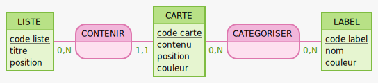

# Modèle Conceptuel des Données (MLD)

MCD pour la première version de mon application.

```text
LISTE: code liste, titre, position

CONTENIR, 11 CARTE, 0N LISTE

CARTE: code carte, contenu, position, couleur

CATEGORISER, 0N CARTE, 0N LABEL

LABEL: code label, nom, couleur
```

---


