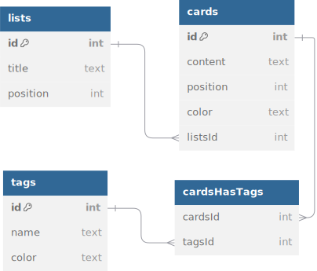

# Modèle Logique des Données (MLD)

Représentation textuelle de la base de données pour la première version de mon application.

```text
lists (
    id              -- entier clé primaire généré automatiquement
    title           -- chaine de caractère
    position        -- entier positif
)

cards (
    id              -- entier clé primaire généré automatiquement
    content         -- chaine de caractère
    position        -- entier positif
    color           -- chaine de caractère au format hexa
    listsId         -- entier clé etrangère
)

tags (
    id              -- entier clé primaire généré automatiquement
    name            -- chaine de caractère
    color           -- chaine de caractère au format hexa
)

cardsHasTags (
    id              -- entier clé primaire généré automatiquement
    cardsId         -- entier clé etrangère
    tagsId          -- entier clé etrangère
)
```

---

Représentation schématisée de la base de données.


